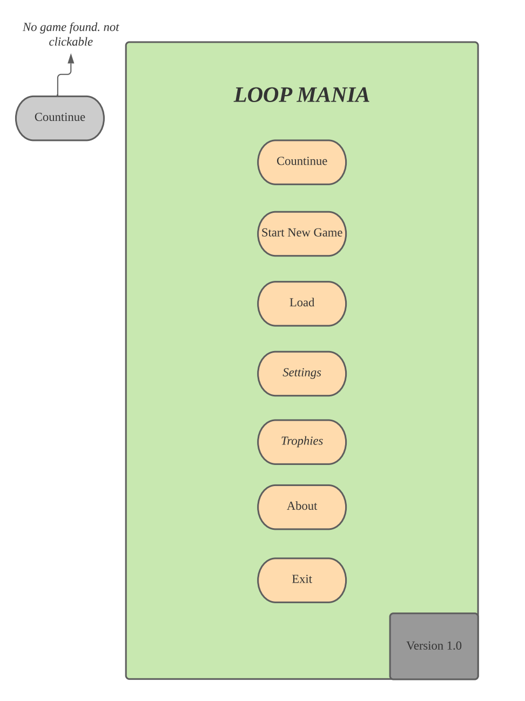
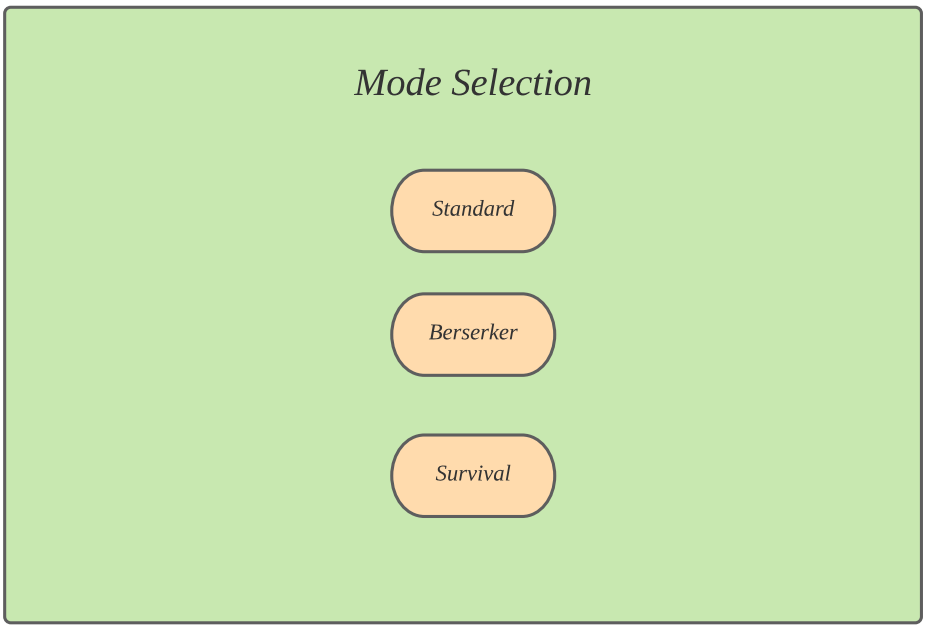
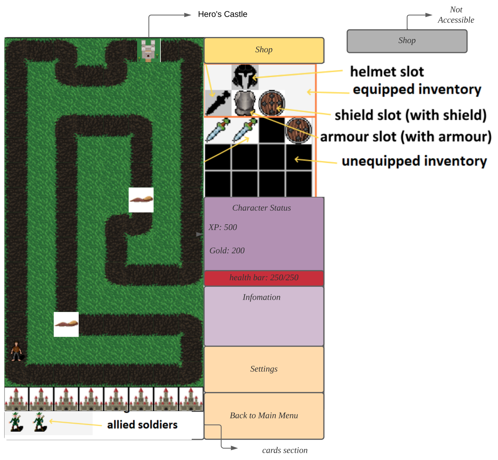
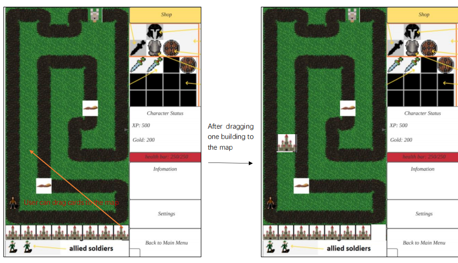
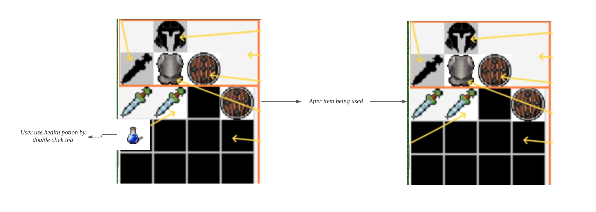
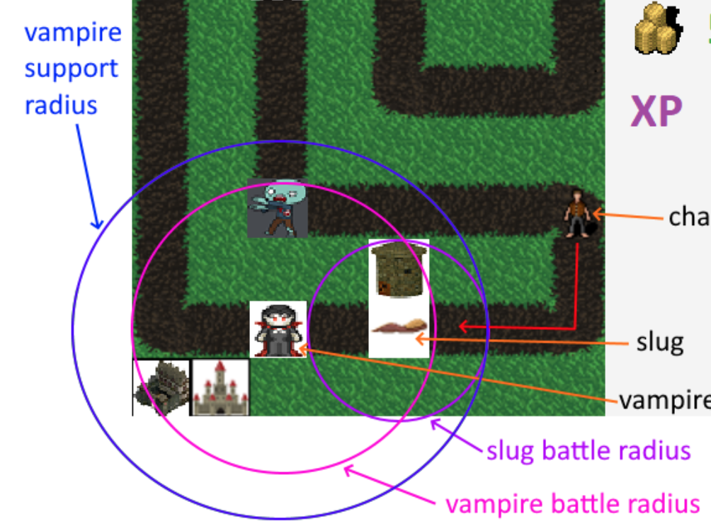
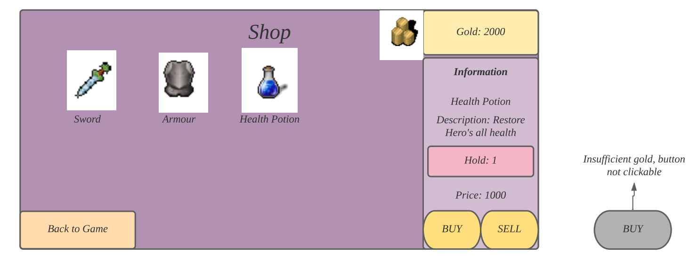

# Frontend Design

## Main Menu

After running the program, the Main Menu will be shown. Here are seven buttons can be clicked by user.

**Clickable buttons**
- **Continue**:  Continue playing Loop Mania, enter game interface (this button will be greyed out, not selectable if user has never started a new game)
- **Start New Game**:   Start a new game of Loop Mania, enter the difficulty choosing interface
- **Load**: Enter saving choosing interface (this extension will be done in milestone 3)
- **Settings**: Enter setting interface, where user can adjust some settings of the game such as volume (this extension will be done in milestone 3)
- **Trophies**: Enter achievement system interface (this extension will be done in milestone 3)
- **About**: Enter the about page, where information of the game is shown (this extension will be done in milestone 3)
- **Exit**: Shutdown loop mania 

*Grey buttons are always unclcikable, orange button relates to system, normally will enter another interface*

At the left bottom, there is a version shows the version of the current software.

  

## Difficulty/Mode choosing interface

Here are 3 mode options. Clicks each button will start a new game with such difficulty. Click one user will enter game interface.

  

## Game interface

- **Map area**: Left area is the main game image, shows the path, current position of character, buildings, enemies.
- **Card area**: Below is the cards area, represent the cards user holds, which can be dragged into the game.
- **Equipment/Item area**: Right upper area present the character's item slot. User can drag item in the unequipped inventory to slot to replace current equipped items. Or click to use consumable item such as health potion.
- **Character status**: Character status present the XP, number of gold and health condition of the character. The percentage of red area of heath bar present the current health condition of the character.
- **Information section**: Information section is the information of the entity user select. It will present the description of the item user select and some attribute of the entity such as bloody, attack, defense. 
- **Setting** button will pause the game and enter setting interface.
- **Back to Main Menu** button will end the game and enter main menu.
- **Shop** button at the right top corner will enter shop interface after clicking. This button is only clickable when character is at Hero's Castle. Shop button turns yellow indicating shop is now accessible, grey indicating is now not accessible.

  

**Dragging** 
Cards in card area and items in equipment area are able to be dragged by user. User can drag a card to the map by selecting a wanted card then drag it to the map and release clicking when it reaches the wanted position. This also applies to equipment/item area where user can drag unequipped items (except items which are not equippable) to one of the equipment slots to equip or replace an item.

  

**Using item**
User can use an usable/consumable item in equipment/item area by double click that item

  

**Radius**
Enemies show their support and battle radius in UI in the color below pic shows when character is close to them.

  

## Shop Interface
Shop interface displays items that are purchaseable by user. Top right corner represent the current gold user hold. User can select one of the commodities by clicking it, then its information will be shown at the right information area, which shows the description and price of the clicked item. User then can click *buy* button to purchase that item. Insufficient gold the *buy* button will be grey and not clickable by user. Back to Game button will back to game interface by clicking it. Hold area indicates the number of such item user has. User can sell it by clicking SELL button. Only when the hold is equal or bigger than 1 the hold button is yellow and clickable, otherwise it is grey.

  

